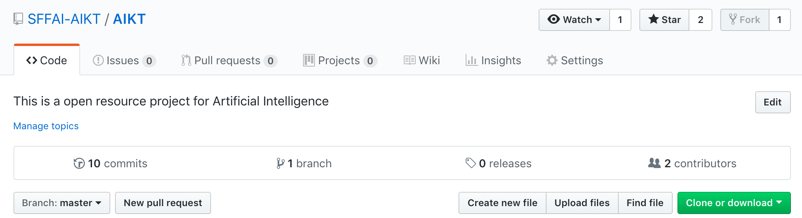
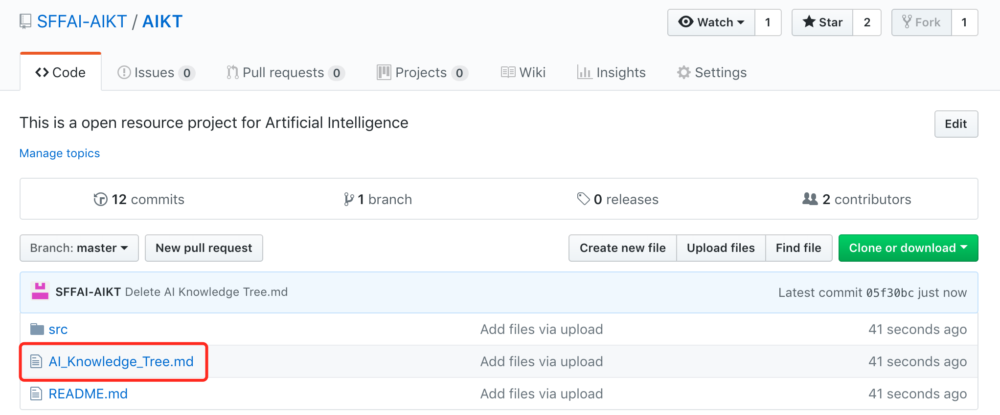
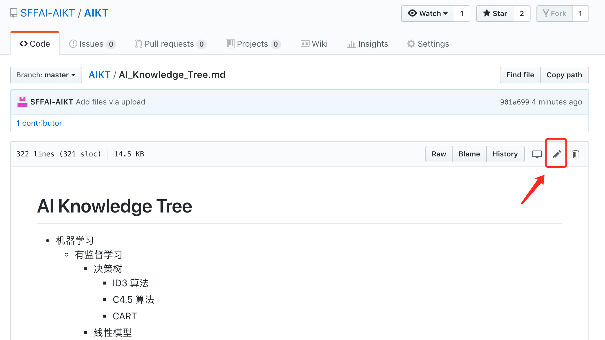
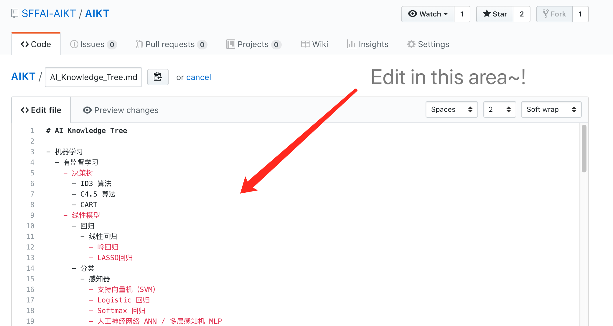
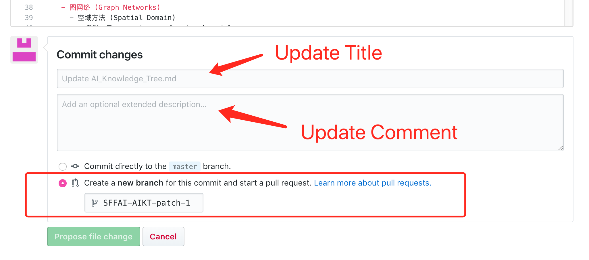
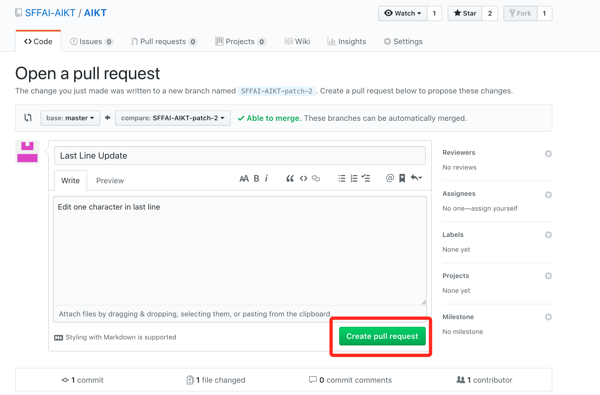
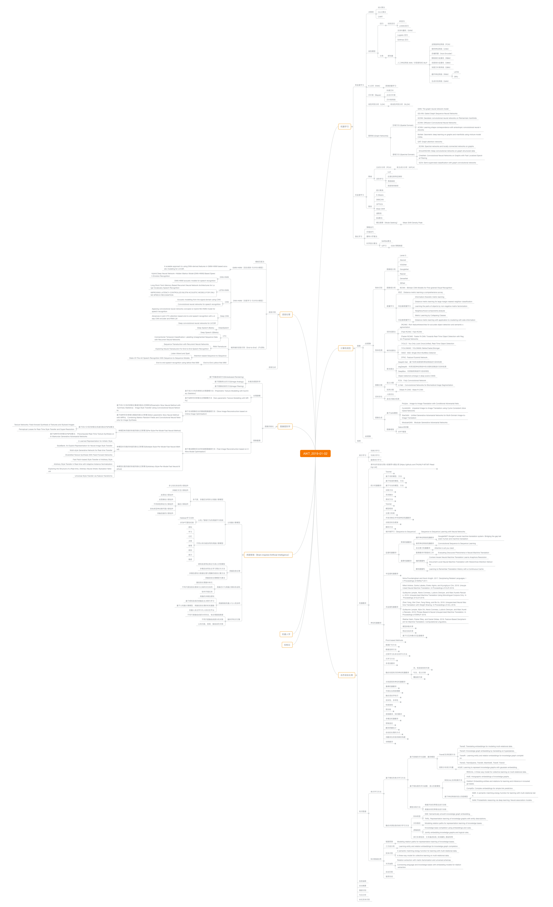

# AI_Knowledge_Tree_Read_Me
This is an open resource project for Artificial Intelligence.

New repository is ongoing: https://github.com/SFFAI-AIKT/AIKT-MAIN

​        本开源项目欢迎各位从事人工智能研究的学界及产业界的同事们一起贡献。人工智能是近几年飞速发展的一个学科，同时也是交叉学科共同融合、共同促进的一个大方向，为了满足人工智能不同领域研究者相互交流、彼此启发的需求，我们发起了SFFAI-人工智能前沿学生论坛及人工智能树公益活动。如果想更多参与SFFAI的活动，可以加小助手的微信“18510866934”，并回复”SFFAI-入群“，小助手会把你拉入SFFAI交流群，不错过SFFAI的各种人工智能前沿活动😊

​        SFFAI论坛，每周举行一期线下活动，邀请一线科研人员分享、讨论人工智能各个领域的前沿思想和最新成果，使专注于各个细分领域的研究者开拓视野、触类旁通。SFFAI目前主要关注机器学习、计算机视觉、自然语言处理等各个人工智能垂直领域及交叉领域的前沿进展，将对线下讨论的内容进行线上传播，使后来者少踩坑，也为讲者塑造个人影响力。

​        人工智能领域的知识树（AI Knowledge Tree），通过汇总各位参与者贡献的领域知识，沉淀线下分享的前沿精华，使AI Knowledge Tree枝繁叶茂，为人工智能社区做出贡献。这项意义非凡的社区工作正在稳步向前，衷心期待和感谢您的支持与奉献！

​        有任何的建议，欢迎发电子邮件到sffai_aikt@mustedu.cn与我们联系～

---

​        如果你也想为SFFAI-AIKT的成长注入一丝雨露和阳光，那么快快follow下面的readme，在Github中帮助AIKT快快成长吧～～

## AIKT 协作方法

### 1. 从Github中找到“SFFAI_AIKT/AIKT”项目

​                    
                              图1 - SFFAI_AIKT/AIKT 项目图

### 2. 选择AI_Knowledge_Tree.md文件进行修改

点击AI_Knowledge_Tree.md 文件（图2），进入预览模式（图3），根据图三的标识即可进入编辑模式（图4）

                              图2 - 选择AI_Knowledge_Tree文件

                              图3 - AI_Knowledge_Tree文件编辑按钮

​                              

                              图4 - AI_Knowledge_Tree文件编辑界面

​                              

### 3. 编辑AIKT 小贴士

在图4所示的界面中，你便可以成功进行编辑AIKT的markdown文件了～特别的有几个注意事项：

3.1 该文件中统一利用缩进形式进行排版AIKT的内容，以便后续的AIKT的图谱生成

- 请大家在编辑的时候注意缩进的层级结构，可以通过tab键进行缩进（本篇文档中统一设置缩进的长度为1个tab键，每一个tab键对应两个空格键）
- 在完成对应的缩进后，请大家输入'-'（键盘上数字0后面的键）并加上一个空格键，已完成markdown的缩进的标识符号
- 如果大家觉得编辑完，不是很放心，可以点击编辑区最上方的第二个部分"Preview changes"来预览自己的修改效果，最主要的是确保缩进的正确性，以方便后续AIKT图谱的生成

3.2 提交方式

当完成编辑后，可以如图5的方式进行提交更新，通过图6的按键确认提交即可🎉

- Update Title：给此次的更新进行命名～
- Update Comment：具体注释一下此次更新的主要内容，以及共享者的信息，以便后续的联系和感谢～推荐留邮箱信息😊
- 提交方式，请选择“Create a new Branch”（建立一个新分支），这样通过项目负责人的审核后，便可以将你的修改融入到整体的AIKT中，当然，如果你需要更高的权限（例如直接修改AIKT，或希望参与到AIKT的编辑核心队伍中，欢迎发送邮件到sffai_aikt@mustedu.cn进行联系～）

                              图5 - AI_Knowledge_Tree文件提交界面

                              图6 - AI_Knowledge_Tree文件确认提交界面

​                              

### 4. 完成编辑

到这里，你对AIKT的修改贡献就完成啦，十分感谢你的奉献，后续项目负责人完成审核后，便会把你的修改融入到整体的AIKT中～！

让我们一起共同为AIKT 浇水吧 😊😊😊

一同看着这棵AIKT茁壮成长起来～～！

---

# AIKT效果图

