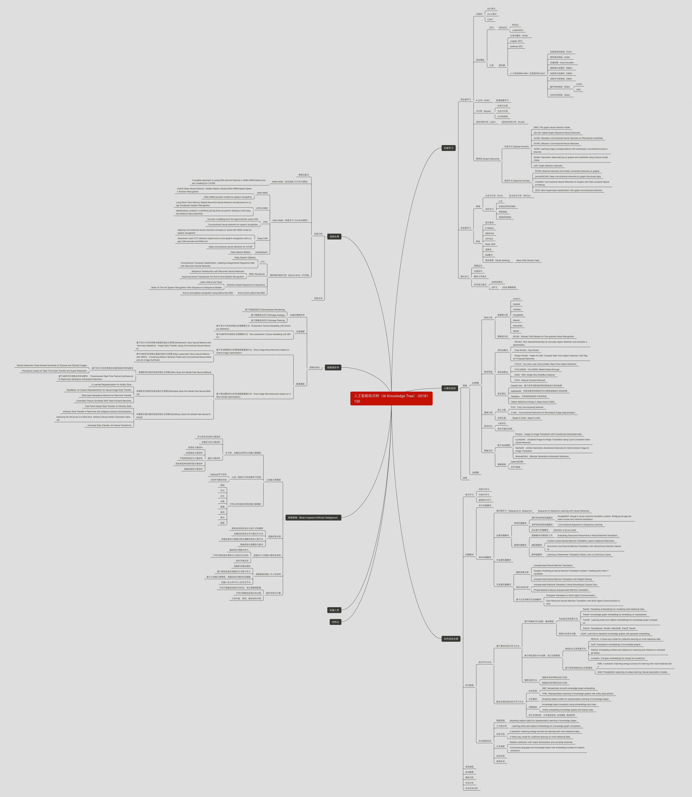

# AI_Knowledge_Tree_Read_Me
This is an open resource project for Artificial Intelligence.

​        本开源项目欢迎各位从事人工智能研究的学界及产业界的同事们一起贡献。人工智能是近几年飞速发展的一个学科，同时也是交叉学科共同融合、共同促进的一个大方向，为了满足人工智能不同领域研究者相互交流、彼此启发的需求，我们发起了SFFAI-人工智能前沿学生论坛及人工智能树公益活动。

​        SFFAI论坛，每周举行一期线下活动，邀请一线科研人员分享、讨论人工智能各个领域的前沿思想和最新成果，使专注于各个细分领域的研究者开拓视野、触类旁通。SFFAI目前主要关注机器学习、计算机视觉、自然语言处理等各个人工智能垂直领域及交叉领域的前沿进展，将对线下讨论的内容进行线上传播，使后来者少踩坑，也为讲者塑造个人影响力。

​        人工智能领域的知识树（AI Knowledge Tree），通过汇总各位参与者贡献的领域知识，沉淀线下分享的前沿精华，使AI Knowledge Tree枝繁叶茂，为人工智能社区做出贡献。这项意义非凡的社区工作正在稳步向前，衷心期待和感谢您的支持与奉献！

---

​        如果你也想为SFFAI-AIKT的成长注入一丝雨露和阳光，那么快快follow下面的readme，在Github中帮助AIKT快快成长吧～～

## AIKT 协作方法

### 1. 从Github中找到“SFFAI_AIKT/AIKT”项目

### 2. 选择AI_Knowledge_Tree.md文件进行修改，如下图所示

